# Design and Simulation of an MLP-Based Controller for FOC Induction Motors


---

## 📋 Table of Contents

- [Overview](#overview)
- [Key Features](#key-features)
- [Project Architecture](#project-architecture)
- [Hardware Specifications](#hardware-specifications)
- [Dataset & Training](#dataset--training)
- [Neural Network Architecture](#neural-network-architecture)
- [Hybrid Control Implementation](#hybrid-control-implementation)
- [Results Summary](#results-summary)
- [Repository Structure](#repository-structure)
- [Installation & Setup](#installation--setup)
- [Usage](#usage)
- [Authors](#authors)
- [License](#license)

---

## 📖 Overview

This project proposes a **hybrid deep learning-based voltage reference generator** that replaces the traditional PI cascade in Field-Oriented Control (FOC) schemes for three-phase induction motor drives. The system leverages a compact Multilayer Perceptron (MLP) neural network trained on a 164 kW motor simulation, augmented with deterministic integral action and circular voltage constraints to ensure robust real-time performance.

### Key Achievements
- **85% reduction** in steady-state torque ripple (2.6%–16.3% vs. 16.8%–31.8%)
- **98.3% improvement** in stator current THD at rated speed (0.38% vs. 22.07%)
- **Sub-1% THD** across all fixed-speed test points (500, 800, 1000, 1500 RPM)
- **Seamless MATLAB/Simulink integration** via custom MATLAB function blocks

---

## ✨ Key Features

- **ML-Based Voltage Reference Generation**: Direct prediction of Vds and Vqs references from motor feedback
- **Hybrid Control Framework**: Neural network + integral action + dynamic circular voltage clamping
- **Comprehensive Data Collection**: Covers 12 operating points with ramp, steady-state, and transient conditions
- **Per-Unit Feature Engineering**: Six-dimensional tracking error vector for improved generalization
- **Robust Real-Time Deployment**: MATLAB function block with guardrails for production use
- **Extensive Validation**: Fixed-speed and variable-speed test profiles with performance metrics

---

## 🏗️ Project Architecture

```text
┌──────────────────────────────────────────────────────────────────┐
│                   3-Φ Induction Motor (164 kW)                   │
│                 Simscape Implementation (MATLAB)                 │
└──────────────────────────────────────────────────────────────────┘
                              ▲
                              │ Feedback
                              │ (ia, ib, ic, ωr)
                              │
┌──────────────────────────────────────────────────────────────────┐
│                  Feature Preparation Layer                       │
│  • Speed error (ω*r - ωr)                                        │
│  • Flux error (i*mr - imr)                                       │
│  • Rotor speed & flux feedback                                   │
│  • d-axis & q-axis currents (idseF, iqseF)                       │
└──────────────────────────────────────────────────────────────────┘
                              ▼
┌──────────────────────────────────────────────────────────────────┐
│              Hybrid MLP Neural Controller (6→64→64→32→2)         │
│  • LayerNorm + ReLU activations                                  │
│  • Integral action compensation (Ki = 0.005)                     │
│  • Asymmetric braking override (Kp = 20.0 for eω < 0)            │
│  • Dynamic circular voltage clamping (Vmax = 2.5 p.u.)           │
└──────────────────────────────────────────────────────────────────┘
                              ▼
                  ┌─────────────────────────┐
                  │  Vds, Vqs References    │
                  └─────────────────────────┘
                              ▼
┌──────────────────────────────────────────────────────────────────┐
│              SVPWM Logic & 3-Φ Power Inverter                    │
│                  (2 kHz switching frequency)                     │
└──────────────────────────────────────────────────────────────────┘
```

#### System Architecture Diagram
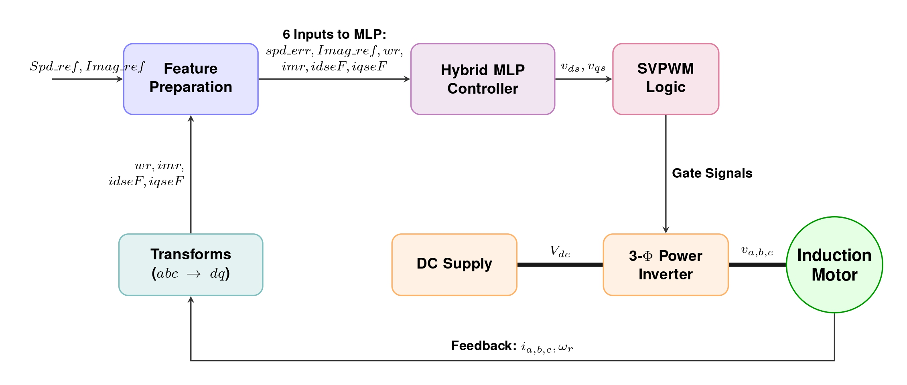

---

## 🔧 Hardware Specifications

| Parameter | Value | Unit |
|-----------|-------|------|
| **Motor Rating** | 164 | kW |
| **Nominal Voltage** | 550 | V (L-L rms) |
| **Rated Frequency** | 50 | Hz |
| **Pole Pairs** | 2 | – |
| **Stator Resistance (Rs)** | 0.0139 | p.u. |
| **Magnetizing Inductance (Lm)** | 2.717 | p.u. |
| **Rotor Resistance (Rr)** | 0.0112 | p.u. |
| **Inertia Constant (H)** | 0.2734 | s |
| **PWM Switching Freq** | 2 | kHz |
| **Controller Sample Time** | 50 | µs |

---

## 📊 Dataset & Training

### Feature Engineering (Per-Unit Tracking Errors)

The six-dimensional input feature vector is constructed as follows:

- **`x₁`** : `ω*r - ωr` *(speed error)*
- **`x₂`** : `i*mr - imr` *(flux error)*
- **`x₃`** : `ωr` *(rotor speed in p.u.)*
- **`x₄`** : `imr` *(rotor flux in p.u.)*
- **`x₅`** : `idseF` *(d-axis stator current, feedback)*
- **`x₆`** : `iqseF` *(q-axis stator current, feedback)*

**Normalization:** Z-score normalization with *ε = 1e-6*
> x̂ⱼ = (xⱼ - μⱼ) / (σⱼ + ε)

### Training Configuration

| Parameter | Value |
|-----------|-------|
| **Framework** | PyTorch 2.0+ |
| **Optimizer** | Adam (α=0.001, β₁=0.9, β₂=0.999) |
| **Loss Function** | Mean Squared Error (MSE) |
| **Epochs** | 1500 |
| **Learning Rate** | 0.001 (fixed) |

#### Training Loss Convergence
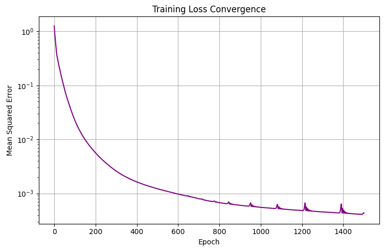

#### Vqs Tracking Performance
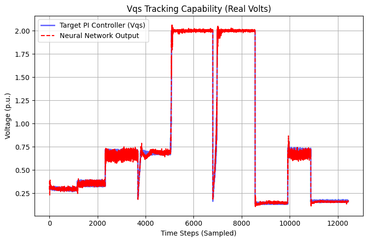

---

## 🧠 Neural Network Architecture

### MLP Topology

- **Input Layer**: 6 features
- **Hidden Layer 1**: Dense (64 neurons) + LayerNorm + ReLU
- **Hidden Layer 2**: Dense (64 neurons) + LayerNorm + ReLU
- **Hidden Layer 3**: Dense (32 neurons) + LayerNorm + ReLU
- **Output Layer**: 2 features `[Vds, Vqs]`
- **Total Parameters**: ~6,600 trainable weights

---

## 🛡️ Hybrid Control Implementation

The pure neural network is extended with three deterministic guardrails for robust real-time deployment:

### 1. Integral Action Compensation
**Problem**: Neural networks lack DC gain, leading to steady-state error drift under load disturbances.  
**Solution**: Discrete-time integral compensator on speed error with an anti-windup hard clamp to ±0.5 p.u.

### 2. Asymmetric Braking Override
**Problem**: Training on symmetric data can yield sluggish deceleration.  
**Solution**: Proportional braking gain when speed error is negative (eω < 0) to prevent violent torque transients and overcurrent spikes during sudden speed reversals.

### 3. Dynamic Circular Voltage Clamping
**Problem**: Inverter DC-link voltage limits (Vmax = 2.5 p.u.) are physical hard constraints.  
**Solution**: Dynamic voltage budget allocation ensuring the voltage vector never exceeds inverter capabilities.

#### Simscape Model Implementation
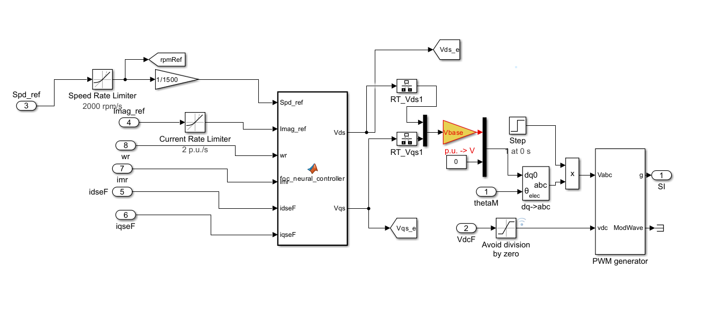

---

## 📈 Results Summary

| Speed (RPM) | Metric | DL Controller | FOC (PI) | Unit |
|:---:|:---:|:---:|:---:|:---:|
| **500** | Overshoot | 20.19 | 1.67 | % |
| | Torque Ripple | 2.67 | 16.87 | % |
| | THD | 0.69 | 0.33 | % |
| **1000** | Overshoot | 2.92 | 0.80 | % |
| | Torque Ripple | **5.27** | 26.95 | % ⬇ 80.4% |
| | THD | 0.16 | 0.53 | % |
| **1500** | Overshoot | 1.03 | 0.00 | % |
| | Torque Ripple | **16.34** | 31.86 | % ⬇ 48.8% |
| | THD | 0.53 | 21.88 | % ⬇ 97.6% |

### Variable-Speed Performance (Dynamic)

**Test Profile**: 500 RPM (0–3 s) → 1000 RPM (3–6 s) → 1500 RPM (6–7.5 s)

| Speed (RPM) | Metric | DL | FOC | Improvement |
|:---:|:---:|:---:|:---:|:---:|
| **1000** | Overshoot | 1.56 | 1.17 | ≈ comparable |
| | Torque Ripple | 7.55 | 27.31 | ⬇ 72.3% |
| | THD | 0.22 | 0.52 | ⬇ 57.7% |
| **1500** | Overshoot | 0.41 | 0.00 | slight increase |
| | Torque Ripple | 17.58 | 32.27 | ⬇ 45.6% |
| | THD | **0.41** | 21.98 | ⬇ **98.1%** |

**Key Insight**: Maximum benefit at rated speed (1500 RPM) where training data density is highest.

### Fixed-Speed Tests (1000 RPM Operating Point)

#### PI Controller Speed Response
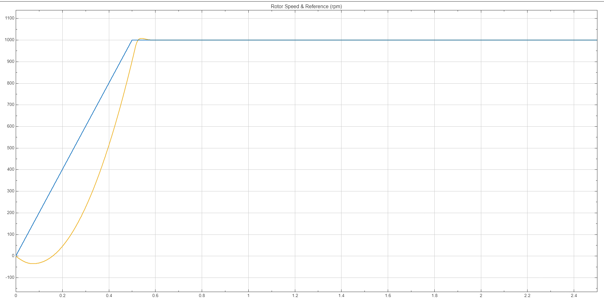

#### DL Controller Speed Response
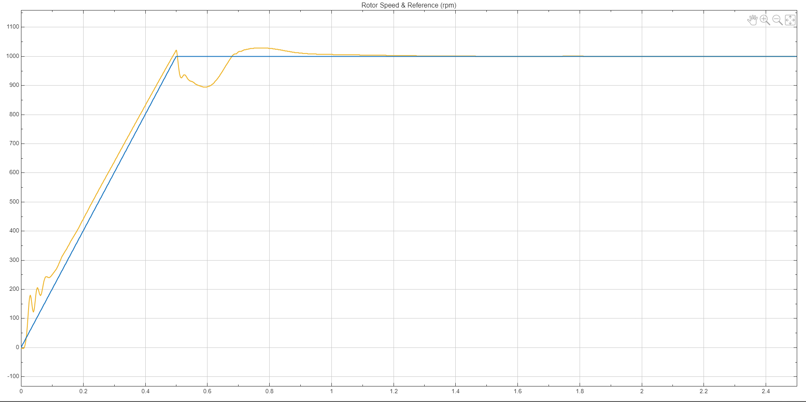

#### DL Controller Torque Ripple
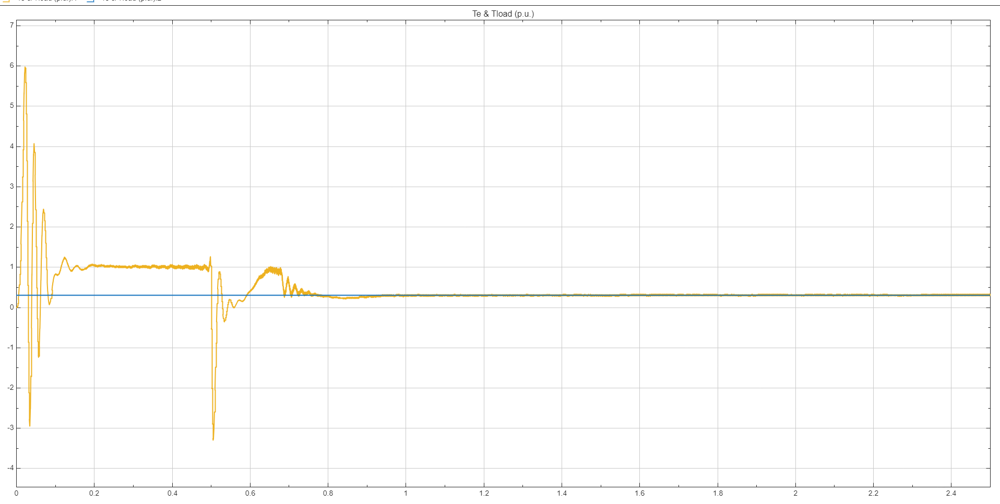

#### DL Controller Stator Current
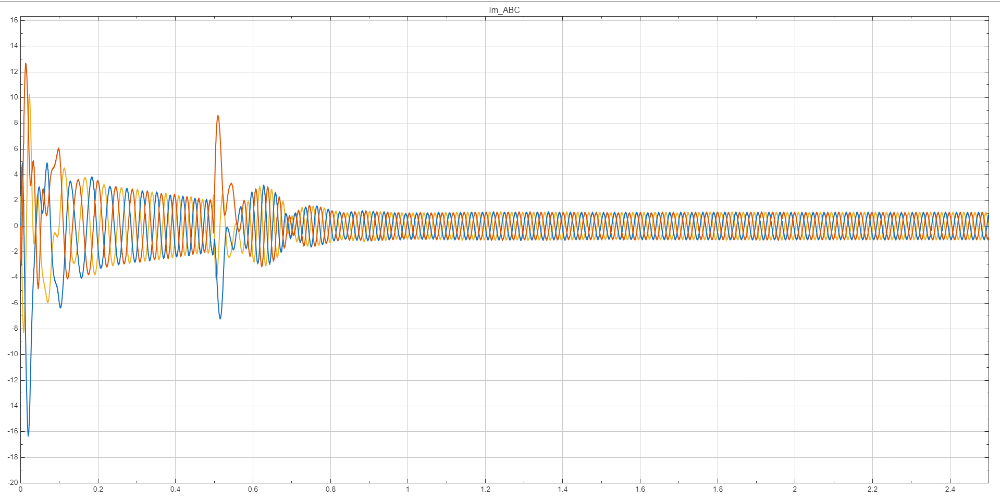

### Variable-Speed Tests (500 → 1000 → 1500 RPM)

#### PI Controller Variable Speed Tracking
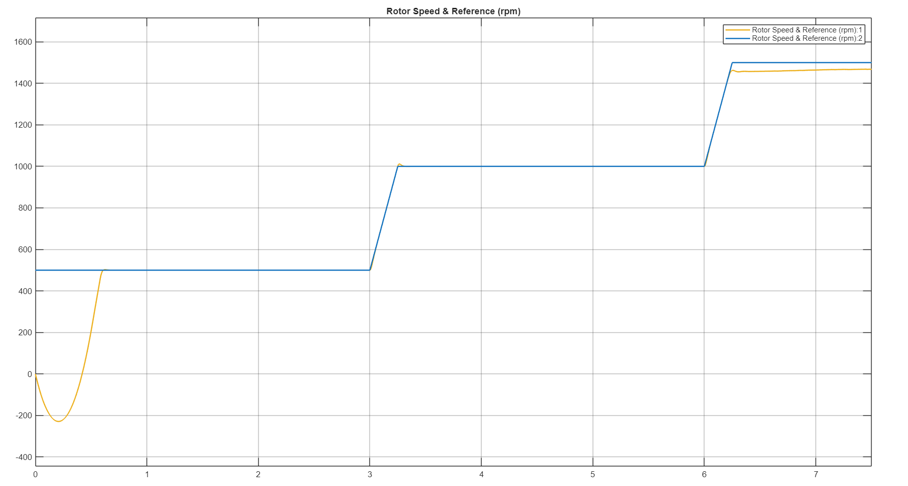

#### PI Controller Variable Torque Response
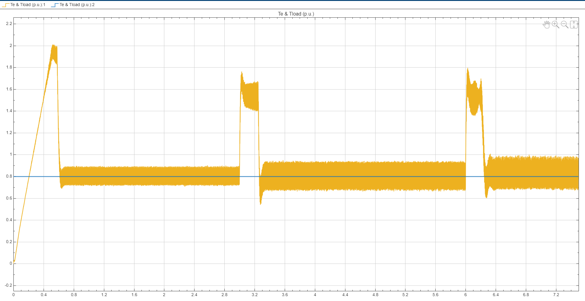

#### PI Controller Stator Current Waveform
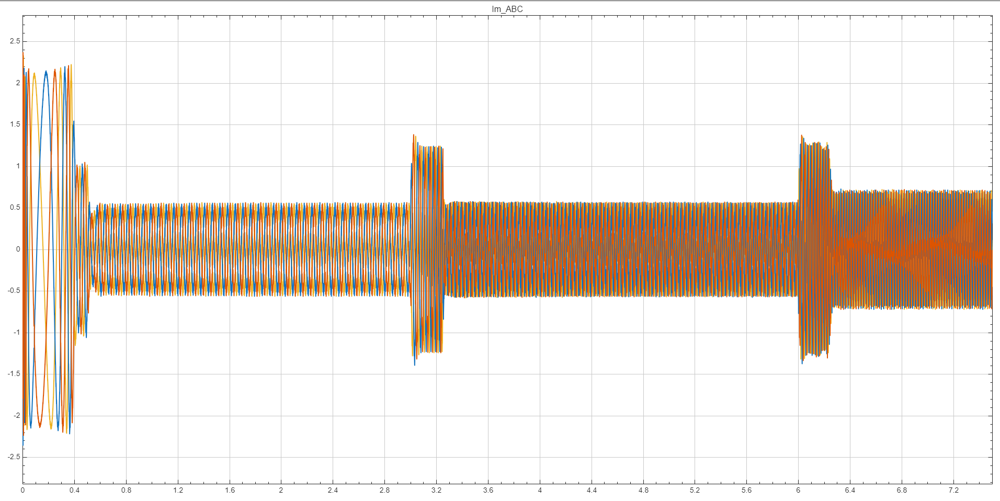

#### DL Controller Variable Speed Tracking
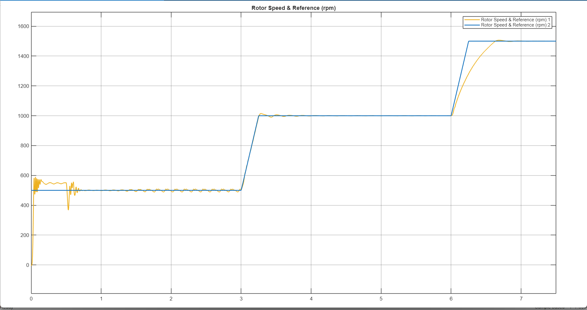

#### DL Controller Variable Torque Response
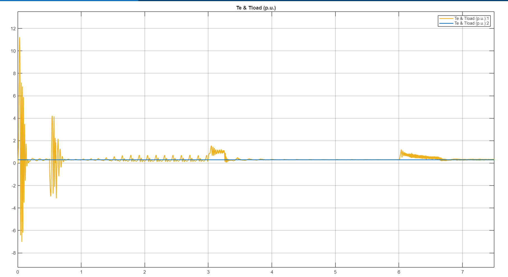

#### DL Controller Stator Current Waveform
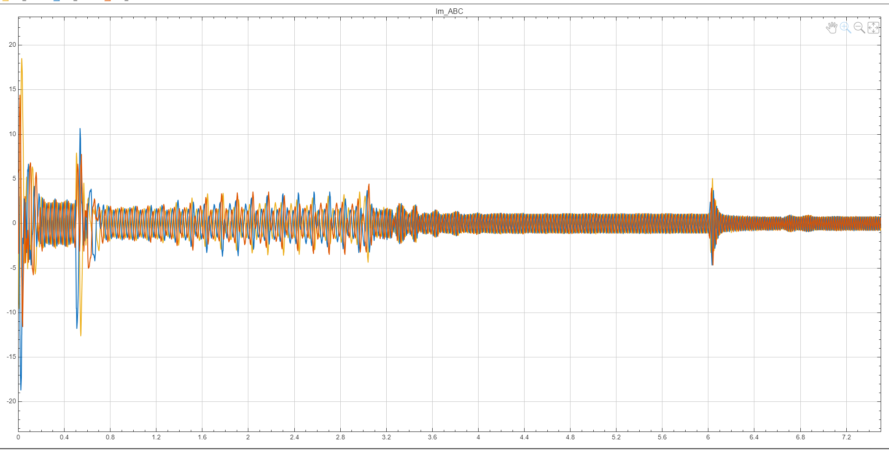

---

## 📁 Repository Structure

```text
Design-and-Simulation-of-an-MLP-Based-Controller-for-FOC-Induction-Motors/
├── Images/                                 
├── Foc_control_of_induction_motor_v1.slx   
├── LICENSE                                 
├── MLP_Control_Of_Induction_Motor.slx      
├── Model_and_motor_parameters_for_FOC.m    
├── Model_training.ipynb                    
├── dum.txt
└── foc_mlp_weights_4.mat                   
```

---

## 🚀 Installation & Setup

### Prerequisites

- **MATLAB R2022a** or later (with Simulink, Simscape, Control System Toolbox)
- **Python 3.8+**
- **Jupyter Notebook**
- **PyTorch 2.0+** ### Step 1: Clone Repository

```bash
git clone [https://github.com/Hackyharish/Design-and-Simulation-of-an-MLP-Based-Controller-for-FOC-Induction-Motors.git](https://github.com/Hackyharish/Design-and-Simulation-of-an-MLP-Based-Controller-for-FOC-Induction-Motors.git)
cd Design-and-Simulation-of-an-MLP-Based-Controller-for-FOC-Induction-Motors
```

### Step 2: Training the MLP Model (Optional)
If you wish to retrain the model or visualize the training process:
1. Open `Model_training.ipynb` in Jupyter Notebook or Google Colab.
2. Ensure you have the required dataset available in your environment.
3. Run the cells sequentially to train the PyTorch model and export the new weights to a `.mat` file.

### Step 3: MATLAB Setup & Simulation
1. Open MATLAB and navigate to the cloned repository directory.
2. Run the parameter initialization script first:
   ```matlab
   Model_and_motor_parameters_for_FOC
   ```
3. Ensure `foc_mlp_weights_4.mat` is in your current working directory.

---

## 💻 Usage

### Running the Conventional PI-FOC Model
1. Open `Foc_control_of_induction_motor_v1.slx` in Simulink.
2. Run the simulation to observe standard baseline performance.
3. Use the scope blocks to view speed tracking, torque ripple, and stator currents.

### Running the Hybrid MLP-FOC Model
1. Open `MLP_Control_Of_Induction_Motor.slx` in Simulink.
2. The model will automatically load the weights from `foc_mlp_weights_4.mat` during initialization.
3. Run the simulation and compare the torque ripple and THD improvements against the baseline.

---

## 🤝 Authors

[**Harish R**](https://www.linkedin.com/in/harish-r-work/)  
Department of Electrical and Electronics Engineering, Amrita Vishwa Vidyapeetham

[**Harshaa V**]()  
Department of Electrical and Electronics Engineering, Amrita Vishwa Vidyapeetham

[**Karthik K**](https://www.linkedin.com/in/karthik-krishnamurthi/)  
Department of Electrical and Electronics Engineering, Amrita Vishwa Vidyapeetham

---

## 📋 License

This project is licensed under the **MIT License** — see [LICENSE](LICENSE) file for details.
